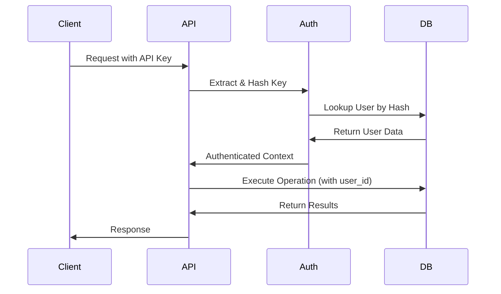

# Memory API Integration Guide

## Overview

The Diogenes Memory API provides a comprehensive multi-tenant memory system for storing and retrieving user-specific entities and memories. Built on Next.js 15 with TypeScript, it leverages Turso (LibSQL) for persistence and implements robust authentication and authorization layers.

### Key Features

- **Multi-tenant architecture** with strict data isolation
- **API key-based authentication** with secure hashing
- **Entity-memory relationship model** for structured data
- **Full-text search capabilities** across memory content
- **RESTful API design** with consistent response formats
- **Type-safe implementation** with comprehensive TypeScript definitions
- **Production-ready** with health monitoring and error handling

### Integration with Diogenes

The Memory API serves as the persistent storage layer for the Diogenes AI assistant, enabling:

- Long-term memory of user interactions and preferences
- Entity relationship tracking (people, organizations, projects, etc.)
- Contextual information retrieval for enhanced AI responses
- User-specific learning and pattern recognition
- Multi-session conversation continuity

## Architecture

### System Components

```
┌─────────────────┐    ┌──────────────────┐    ┌─────────────────┐
│   Client Apps   │    │   Next.js API    │    │  Turso Database │
│  (React/Web)    │◄──►│    Routes        │◄──►│   (LibSQL)      │
│                 │    │                  │    │                 │
└─────────────────┘    └──────────────────┘    └─────────────────┘
                              │
                              ▼
                       ┌──────────────────┐
                       │  Authentication  │
                       │   Middleware     │
                       └──────────────────┘
```

### Database Schema

The Memory API uses five core tables with strict multi-tenant isolation:

#### Users Table
```sql
CREATE TABLE users (
    id TEXT PRIMARY KEY,
    email TEXT UNIQUE NOT NULL,
    name TEXT NOT NULL,
    api_key_hash TEXT UNIQUE NOT NULL,
    is_active INTEGER DEFAULT 1,
    created_at TEXT DEFAULT CURRENT_TIMESTAMP
);
```

#### Entities Table
```sql
CREATE TABLE entities (
    id TEXT PRIMARY KEY,
    user_id TEXT NOT NULL,
    entity_type TEXT NOT NULL,
    name TEXT NOT NULL,
    description TEXT,
    metadata TEXT DEFAULT '{}',
    created_at TEXT DEFAULT CURRENT_TIMESTAMP,
    updated_at TEXT DEFAULT CURRENT_TIMESTAMP,
    FOREIGN KEY (user_id) REFERENCES users(id)
);
```

#### Memories Table
```sql
CREATE TABLE memories (
    id TEXT PRIMARY KEY,
    user_id TEXT NOT NULL,
    entity_id TEXT NOT NULL,
    memory_type TEXT NOT NULL,
    title TEXT NOT NULL,
    content TEXT NOT NULL,
    metadata TEXT DEFAULT '{}',
    importance INTEGER DEFAULT 1,
    created_at TEXT DEFAULT CURRENT_TIMESTAMP,
    updated_at TEXT DEFAULT CURRENT_TIMESTAMP,
    FOREIGN KEY (user_id) REFERENCES users(id),
    FOREIGN KEY (entity_id) REFERENCES entities(id)
);
```

#### Interactions Table
```sql
CREATE TABLE interactions (
    id TEXT PRIMARY KEY,
    user_id TEXT NOT NULL,
    entity_id TEXT,
    user_input TEXT NOT NULL,
    assistant_response TEXT NOT NULL,
    context TEXT DEFAULT '{}',
    metadata TEXT DEFAULT '{}',
    created_at TEXT DEFAULT CURRENT_TIMESTAMP,
    FOREIGN KEY (user_id) REFERENCES users(id),
    FOREIGN KEY (entity_id) REFERENCES entities(id)
);
```

#### Learned Patterns Table
```sql
CREATE TABLE learned_patterns (
    id TEXT PRIMARY KEY,
    user_id TEXT NOT NULL,
    pattern TEXT NOT NULL,
    response TEXT NOT NULL,
    frequency INTEGER DEFAULT 1,
    confidence REAL DEFAULT 0.5,
    metadata TEXT DEFAULT '{}',
    created_at TEXT DEFAULT CURRENT_TIMESTAMP,
    updated_at TEXT DEFAULT CURRENT_TIMESTAMP,
    FOREIGN KEY (user_id) REFERENCES users(id)
);
```

### Authentication Flow



### Multi-tenant Isolation

Every database operation includes the authenticated user's ID in the WHERE clause, ensuring complete data isolation:

```typescript
// Example: User A cannot access User B's entities
const entities = await db.execute(
  'SELECT * FROM entities WHERE user_id = ?',
  [authenticatedUserId]
);
```

## API Reference

### Base URL
```
https://your-domain.com/api/memory
```

### Authentication

All endpoints (except health) require authentication via the `Authorization` header:

```bash
# Bearer format
Authorization: Bearer your-api-key-here

# ApiKey format
Authorization: ApiKey your-api-key-here

# Raw format
Authorization: your-api-key-here
```

### Response Format

**Success Response:**
```json
{
  "success": true,
  "data": { ... },
  "message": "Optional success message"
}
```

**Error Response:**
```json
{
  "success": false,
  "error": "Error message",
  "code": "ERROR_CODE",
  "details": { ... }
}
```

### Endpoints

#### Health Check

**GET /api/memory/health**
- **Description:** Basic system health check
- **Authentication:** None required
- **Response:**
```json
{
  "success": true,
  "data": {
    "status": "healthy",
    "timestamp": "2024-03-20T10:30:00Z",
    "database": "connected"
  }
}
```

**POST /api/memory/health**
- **Description:** Extended health check with diagnostics
- **Authentication:** None required
- **Request Body:**
```json
{
  "diagnostics": true
}
```

#### Entity Management

**GET /api/memory/entities**
- **Description:** List user's entities with pagination
- **Query Parameters:**
  - `page`: Page number (default: 1)
  - `limit`: Items per page (default: 50, max: 100)
- **Response:**
```json
{
  "success": true,
  "data": {
    "data": [
      {
        "id": "uuid",
        "entity_type": "person",
        "name": "John Doe",
        "description": "Software engineer",
        "metadata": {"role": "developer"},
        "created_at": "2024-03-20T10:30:00Z",
        "updated_at": "2024-03-20T10:30:00Z"
      }
    ],
    "pagination": {
      "page": 1,
      "limit": 50,
      "total": 1,
      "has_next": false,
      "has_prev": false
    }
  }
}
```

**POST /api/memory/entities**
- **Description:** Create a new entity
- **Request Body:**
```json
{
  "entity_type": "person",
  "name": "John Doe",
  "description": "Software engineer",
  "metadata": {"role": "developer", "team": "backend"}
}
```
- **Valid Entity Types:** `person`, `organization`, `project`, `concept`, `location`, `event`, `other`
- **Validation Rules:**
  - `name`: Required, 1-255 characters
  - `description`: Optional, max 1000 characters
  - `entity_type`: Must be one of valid types

**GET /api/memory/entities/[id]**
- **Description:** Get specific entity by ID
- **Response:** Single entity object

**PUT /api/memory/entities/[id]**
- **Description:** Update entity
- **Request Body:** Partial entity object (name, description, metadata)

**DELETE /api/memory/entities/[id]**
- **Description:** Delete entity (and all associated memories)
- **Response:** `{"success": true, "message": "Entity deleted"}`

#### Memory Management

**GET /api/memory/memories**
- **Description:** List user's memories with pagination
- **Query Parameters:**
  - `page`: Page number (default: 1)
  - `limit`: Items per page (default: 50, max: 100)
  - `entity_id`: Filter by entity ID (optional)
- **Response:**
```json
{
  "success": true,
  "data": {
    "data": [
      {
        "id": "uuid",
        "entity_id": "entity-uuid",
        "memory_type": "preference",
        "title": "Preferred Language",
        "content": "Prefers TypeScript for development",
        "metadata": {"category": "work"},
        "importance": 7,
        "created_at": "2024-03-20T10:30:00Z",
        "updated_at": "2024-03-20T10:30:00Z"
      }
    ],
    "pagination": { ... }
  }
}
```

**POST /api/memory/memories**
- **Description:** Create a new memory
- **Request Body:**
```json
{
  "entity_id": "entity-uuid",
  "memory_type": "preference",
  "title": "Preferred Programming Language",
  "content": "John prefers TypeScript for backend development",
  "importance": 7,
  "metadata": {"category": "work", "tags": ["programming"]}
}
```
- **Valid Memory Types:** `fact`, `preference`, `experience`, `instruction`, `context`, `relationship`, `skill`, `goal`, `other`
- **Validation Rules:**
  - `entity_id`: Must exist and belong to user
  - `title`: Required, max 255 characters
  - `content`: Required, max 10000 characters
  - `importance`: 1-10 scale (default: 1)

**GET /api/memory/memories/[id]**
- **Description:** Get specific memory by ID

**PUT /api/memory/memories/[id]**
- **Description:** Update memory
- **Request Body:** Partial memory object (title, content, metadata, importance)

**DELETE /api/memory/memories/[id]**
- **Description:** Delete memory

#### Search

**POST /api/memory/search**
- **Description:** Search memories by content
- **Request Body:**
```json
{
  "query": "TypeScript development",
  "entity_id": "optional-entity-uuid",
  "limit": 20
}
```
- **Response:**
```json
{
  "success": true,
  "data": {
    "query": "TypeScript development",
    "entity_id": null,
    "results": [ ... ],
    "total_results": 5,
    "limit": 20
  }
}
```

**GET /api/memory/search**
- **Description:** Alternative search using query parameters
- **Query Parameters:**
  - `q` or `query`: Search query (required)
  - `entity_id`: Filter by entity (optional)
  - `limit`: Max results (default: 50, max: 100)

#### Testing

**GET /api/memory/test**
- **Description:** Basic multi-tenant isolation tests
- **Query Parameters:**
  - `type`: Test type (`isolation`, `endpoints`, `consistency`)

**POST /api/memory/test**
- **Description:** Advanced test scenarios
- **Request Body:**
```json
{
  "scenarios": ["tenant_isolation", "api_endpoints", "data_consistency"]
}
```

## Data Models

### TypeScript Interfaces

#### Core Database Types
```typescript
export interface User {
  id: string
  email: string
  name: string
  api_key_hash: string
  is_active: number // SQLite boolean (0/1)
  created_at: string
}

export interface Entity {
  id: string
  user_id: string
  entity_type: string
  name: string
  description?: string
  metadata: string // JSON string
  created_at: string
  updated_at: string
}

export interface Memory {
  id: string
  user_id: string
  entity_id: string
  memory_type: string
  title: string
  content: string
  metadata: string // JSON string
  importance: number
  created_at: string
  updated_at: string
}
```

#### API Request/Response Types
```typescript
export interface CreateEntityRequest {
  entity_type: string
  name: string
  description?: string
  metadata?: Record<string, any>
}

export interface CreateMemoryRequest {
  entity_id: string
  memory_type: string
  title: string
  content: string
  metadata?: Record<string, any>
  importance?: number
}

export interface SearchMemoriesRequest {
  query: string
  entity_id?: string
  limit?: number
}

export interface EntityResponse {
  id: string
  entity_type: string
  name: string
  description?: string
  metadata: Record<string, any>
  created_at: string
  updated_at: string
}

export interface MemoryResponse {
  id: string
  entity_id: string
  memory_type: string
  title: string
  content: string
  metadata: Record<string, any>
  importance: number
  created_at: string
  updated_at: string
}
```

#### Error Handling
```typescript
export enum ErrorCode {
  UNAUTHORIZED = 'UNAUTHORIZED',
  FORBIDDEN = 'FORBIDDEN',
  NOT_FOUND = 'NOT_FOUND',
  VALIDATION_ERROR = 'VALIDATION_ERROR',
  DATABASE_ERROR = 'DATABASE_ERROR',
  INTERNAL_ERROR = 'INTERNAL_ERROR'
}

export interface ApiError {
  code: ErrorCode
  message: string
  details?: Record<string, any>
}
```

## Integration Guide

### React Component Integration

#### Custom Hook for Memory API
```typescript
// hooks/useMemoryApi.ts
import { useState, useCallback } from 'react'
import type { EntityResponse, MemoryResponse, ApiResponse } from '@/types/memory'

const API_BASE = '/api/memory'

export function useMemoryApi(apiKey: string) {
  const [loading, setLoading] = useState(false)
  const [error, setError] = useState<string | null>(null)

  const headers = {
    'Authorization': `Bearer ${apiKey}`,
    'Content-Type': 'application/json',
  }

  const createEntity = useCallback(async (data: {
    entity_type: string
    name: string
    description?: string
    metadata?: Record<string, any>
  }): Promise<EntityResponse | null> => {
    setLoading(true)
    setError(null)

    try {
      const response = await fetch(`${API_BASE}/entities`, {
        method: 'POST',
        headers,
        body: JSON.stringify(data),
      })

      const result: ApiResponse<EntityResponse> = await response.json()

      if (!result.success) {
        throw new Error(result.error)
      }

      return result.data || null
    } catch (err) {
      setError(err instanceof Error ? err.message : 'Unknown error')
      return null
    } finally {
      setLoading(false)
    }
  }, [apiKey])

  const createMemory = useCallback(async (data: {
    entity_id: string
    memory_type: string
    title: string
    content: string
    metadata?: Record<string, any>
    importance?: number
  }): Promise<MemoryResponse | null> => {
    setLoading(true)
    setError(null)

    try {
      const response = await fetch(`${API_BASE}/memories`, {
        method: 'POST',
        headers,
        body: JSON.stringify(data),
      })

      const result: ApiResponse<MemoryResponse> = await response.json()

      if (!result.success) {
        throw new Error(result.error)
      }

      return result.data || null
    } catch (err) {
      setError(err instanceof Error ? err.message : 'Unknown error')
      return null
    } finally {
      setLoading(false)
    }
  }, [apiKey])

  const searchMemories = useCallback(async (query: string, entityId?: string): Promise<MemoryResponse[]> => {
    setLoading(true)
    setError(null)

    try {
      const response = await fetch(`${API_BASE}/search`, {
        method: 'POST',
        headers,
        body: JSON.stringify({ query, entity_id: entityId }),
      })

      const result: ApiResponse<{results: MemoryResponse[]}> = await response.json()

      if (!result.success) {
        throw new Error(result.error)
      }

      return result.data?.results || []
    } catch (err) {
      setError(err instanceof Error ? err.message : 'Unknown error')
      return []
    } finally {
      setLoading(false)
    }
  }, [apiKey])

  return {
    loading,
    error,
    createEntity,
    createMemory,
    searchMemories,
  }
}
```

#### React Component Example
```typescript
// components/MemoryManager.tsx
import React, { useState, useEffect } from 'react'
import { useMemoryApi } from '@/hooks/useMemoryApi'
import type { EntityResponse, MemoryResponse } from '@/types/memory'

interface MemoryManagerProps {
  apiKey: string
}

export function MemoryManager({ apiKey }: MemoryManagerProps) {
  const { loading, error, createEntity, createMemory, searchMemories } = useMemoryApi(apiKey)
  const [entities, setEntities] = useState<EntityResponse[]>([])
  const [memories, setMemories] = useState<MemoryResponse[]>([])
  const [searchQuery, setSearchQuery] = useState('')

  // Load entities on component mount
  useEffect(() => {
    async function loadEntities() {
      try {
        const response = await fetch('/api/memory/entities', {
          headers: { 'Authorization': `Bearer ${apiKey}` }
        })
        const result = await response.json()
        if (result.success) {
          setEntities(result.data.data)
        }
      } catch (err) {
        console.error('Failed to load entities:', err)
      }
    }

    loadEntities()
  }, [apiKey])

  const handleCreateEntity = async (formData: FormData) => {
    const entityData = {
      entity_type: formData.get('entity_type') as string,
      name: formData.get('name') as string,
      description: formData.get('description') as string || undefined,
    }

    const newEntity = await createEntity(entityData)
    if (newEntity) {
      setEntities(prev => [...prev, newEntity])
    }
  }

  const handleCreateMemory = async (formData: FormData) => {
    const memoryData = {
      entity_id: formData.get('entity_id') as string,
      memory_type: formData.get('memory_type') as string,
      title: formData.get('title') as string,
      content: formData.get('content') as string,
      importance: parseInt(formData.get('importance') as string) || 1,
    }

    const newMemory = await createMemory(memoryData)
    if (newMemory) {
      setMemories(prev => [...prev, newMemory])
    }
  }

  const handleSearch = async () => {
    if (searchQuery.trim()) {
      const results = await searchMemories(searchQuery)
      setMemories(results)
    }
  }

  return (
    <div className="memory-manager">
      {error && (
        <div className="error-banner">
          Error: {error}
        </div>
      )}

      {/* Entity Creation Form */}
      <section>
        <h2>Create Entity</h2>
        <form onSubmit={(e) => {
          e.preventDefault()
          handleCreateEntity(new FormData(e.currentTarget))
        }}>
          <select name="entity_type" required>
            <option value="person">Person</option>
            <option value="organization">Organization</option>
            <option value="project">Project</option>
            <option value="concept">Concept</option>
            <option value="location">Location</option>
            <option value="event">Event</option>
            <option value="other">Other</option>
          </select>
          <input name="name" placeholder="Entity name" required />
          <textarea name="description" placeholder="Description (optional)" />
          <button type="submit" disabled={loading}>
            {loading ? 'Creating...' : 'Create Entity'}
          </button>
        </form>
      </section>

      {/* Memory Creation Form */}
      <section>
        <h2>Create Memory</h2>
        <form onSubmit={(e) => {
          e.preventDefault()
          handleCreateMemory(new FormData(e.currentTarget))
        }}>
          <select name="entity_id" required>
            <option value="">Select Entity</option>
            {entities.map(entity => (
              <option key={entity.id} value={entity.id}>
                {entity.name}
              </option>
            ))}
          </select>
          <select name="memory_type" required>
            <option value="fact">Fact</option>
            <option value="preference">Preference</option>
            <option value="experience">Experience</option>
            <option value="instruction">Instruction</option>
            <option value="context">Context</option>
            <option value="relationship">Relationship</option>
            <option value="skill">Skill</option>
            <option value="goal">Goal</option>
            <option value="other">Other</option>
          </select>
          <input name="title" placeholder="Memory title" required />
          <textarea name="content" placeholder="Memory content" required />
          <input name="importance" type="number" min="1" max="10" defaultValue="1" />
          <button type="submit" disabled={loading}>
            {loading ? 'Creating...' : 'Create Memory'}
          </button>
        </form>
      </section>

      {/* Search Interface */}
      <section>
        <h2>Search Memories</h2>
        <div className="search-bar">
          <input
            value={searchQuery}
            onChange={(e) => setSearchQuery(e.target.value)}
            placeholder="Search memories..."
            onKeyDown={(e) => e.key === 'Enter' && handleSearch()}
          />
          <button onClick={handleSearch} disabled={loading}>
            Search
          </button>
        </div>
      </section>

      {/* Results Display */}
      <section>
        <h2>Memories</h2>
        {memories.length === 0 ? (
          <p>No memories found</p>
        ) : (
          <div className="memories-list">
            {memories.map(memory => (
              <div key={memory.id} className="memory-card">
                <h3>{memory.title}</h3>
                <p>{memory.content}</p>
                <div className="memory-meta">
                  <span>Type: {memory.memory_type}</span>
                  <span>Importance: {memory.importance}/10</span>
                  <span>Created: {new Date(memory.created_at).toLocaleDateString()}</span>
                </div>
              </div>
            ))}
          </div>
        )}
      </section>
    </div>
  )
}
```

### Server Component Integration

```typescript
// app/memories/page.tsx
import { headers } from 'next/headers'
import { MemoryList } from '@/components/MemoryList'
import type { MemoryResponse } from '@/types/memory'

async function getMemories(apiKey: string): Promise<MemoryResponse[]> {
  try {
    const response = await fetch(`${process.env.NEXT_PUBLIC_URL}/api/memory/memories`, {
      headers: {
        'Authorization': `Bearer ${apiKey}`,
      },
      cache: 'no-store', // Always fetch fresh data
    })

    const result = await response.json()
    return result.success ? result.data.data : []
  } catch (error) {
    console.error('Failed to fetch memories:', error)
    return []
  }
}

export default async function MemoriesPage() {
  // Get API key from headers, session, or other secure source
  const apiKey = headers().get('x-api-key') || process.env.DEFAULT_API_KEY

  if (!apiKey) {
    return <div>API key required</div>
  }

  const memories = await getMemories(apiKey)

  return (
    <div>
      <h1>Your Memories</h1>
      <MemoryList memories={memories} />
    </div>
  )
}
```

### API Route Integration

```typescript
// app/api/chat/route.ts
import { NextRequest } from 'next/server'
import { searchMemoriesForContext } from '@/lib/memory-context'

export async function POST(request: NextRequest) {
  try {
    const { message, apiKey } = await request.json()

    // Search for relevant memories to provide context
    const relevantMemories = await searchMemoriesForContext(apiKey, message)

    // Use memories to enhance AI response
    const contextualResponse = await generateAIResponse(message, relevantMemories)

    return Response.json({
      success: true,
      data: {
        response: contextualResponse,
        context_memories: relevantMemories.length
      }
    })
  } catch (error) {
    return Response.json({
      success: false,
      error: 'Failed to process chat message'
    }, { status: 500 })
  }
}

// lib/memory-context.ts
import type { MemoryResponse } from '@/types/memory'

export async function searchMemoriesForContext(
  apiKey: string,
  userMessage: string
): Promise<MemoryResponse[]> {
  try {
    // Extract key terms from user message for search
    const searchTerms = extractKeyTerms(userMessage)

    const response = await fetch(`${process.env.NEXT_PUBLIC_URL}/api/memory/search`, {
      method: 'POST',
      headers: {
        'Authorization': `Bearer ${apiKey}`,
        'Content-Type': 'application/json',
      },
      body: JSON.stringify({
        query: searchTerms.join(' '),
        limit: 10
      }),
    })

    const result = await response.json()
    return result.success ? result.data.results : []
  } catch (error) {
    console.error('Failed to search memories for context:', error)
    return []
  }
}

function extractKeyTerms(message: string): string[] {
  // Simple keyword extraction - in production, use more sophisticated NLP
  return message
    .toLowerCase()
    .split(/\s+/)
    .filter(word => word.length > 3)
    .slice(0, 5)
}
```

## Security & Multi-tenancy

### Authentication Requirements

1. **API Key Generation**: Generate cryptographically secure API keys
```typescript
import { randomBytes } from 'crypto'

function generateApiKey(): string {
  return randomBytes(32).toString('hex')
}
```

2. **Secure Hashing**: API keys are hashed before storage
```typescript
import { createHash } from 'crypto'

function hashApiKey(apiKey: string): string {
  return createHash('sha256').update(apiKey).digest('hex')
}
```

3. **User Verification**: Every request verifies user ownership
```typescript
// All queries include user_id filter
const results = await db.execute(
  'SELECT * FROM memories WHERE user_id = ? AND entity_id = ?',
  [userId, entityId]
)
```

### Data Isolation

- **Database Level**: All tables include `user_id` foreign key
- **Query Level**: All queries filter by authenticated user ID
- **Validation Level**: Entity ownership verified before operations
- **Response Level**: Only user-owned data returned

### Rate Limiting

Implement rate limiting for production use:

```typescript
// middleware/rateLimit.ts
import { NextRequest } from 'next/server'

const rateLimits = new Map<string, { count: number; resetTime: number }>()

export function rateLimit(request: NextRequest, limit = 100, windowMs = 60000) {
  const apiKey = extractApiKey(request)
  if (!apiKey) return false

  const now = Date.now()
  const userLimit = rateLimits.get(apiKey)

  if (!userLimit || now > userLimit.resetTime) {
    rateLimits.set(apiKey, { count: 1, resetTime: now + windowMs })
    return true
  }

  if (userLimit.count >= limit) {
    return false
  }

  userLimit.count++
  return true
}
```

### Data Privacy

- **Encryption at Rest**: Turso provides encryption for stored data
- **Encryption in Transit**: HTTPS enforced for all API communications
- **Metadata Security**: Sensitive data stored in encrypted metadata fields
- **Audit Logging**: All operations logged with user and timestamp

## Development

### Local Development Setup

1. **Install Dependencies**
```bash
npm install
# or
yarn install
# or
pnpm install
```

2. **Environment Configuration**
Create `.env.local` file:
```bash
TURSO_DATABASE_URL=libsql://your-database.turso.io
TURSO_AUTH_TOKEN=your-auth-token
NEXT_PUBLIC_URL=http://localhost:3000
```

3. **Database Setup**
Ensure your Turso database has the required tables. Use the schema provided in the Architecture section.

4. **Start Development Server**
```bash
npm run dev
```

5. **Test API Health**
```bash
curl http://localhost:3000/api/memory/health
```

### Environment Variables

Required variables:
- `TURSO_DATABASE_URL`: Your Turso database URL
- `TURSO_AUTH_TOKEN`: Your Turso authentication token

Optional variables:
- `NEXT_PUBLIC_URL`: Base URL for API calls (defaults to current domain)
- `LOG_LEVEL`: Logging level (debug, info, warn, error)
- `RATE_LIMIT_REQUESTS`: Requests per minute limit (default: 100)
- `RATE_LIMIT_WINDOW`: Rate limit window in milliseconds (default: 60000)

### Testing the API

#### Create Test User
```sql
INSERT INTO users (id, email, name, api_key_hash, is_active)
VALUES (
  'test-user-id',
  'test@example.com',
  'Test User',
  -- Hash of 'test-api-key'
  'c4d7c68388c8b5c8c8b5d7c68388c8b5c8c8b5d7c68388c8b5c8c8b5d7c68388c8',
  1
);
```

#### API Testing Scripts
```bash
#!/bin/bash
# test-api.sh

API_KEY="test-api-key"
BASE_URL="http://localhost:3000/api/memory"

echo "Testing Health Check..."
curl -s "$BASE_URL/health" | jq

echo -e "\nTesting Entity Creation..."
ENTITY_ID=$(curl -s -X POST "$BASE_URL/entities" \
  -H "Authorization: Bearer $API_KEY" \
  -H "Content-Type: application/json" \
  -d '{
    "entity_type": "person",
    "name": "John Doe",
    "description": "Test user"
  }' | jq -r '.data.id')

echo "Created entity: $ENTITY_ID"

echo -e "\nTesting Memory Creation..."
curl -s -X POST "$BASE_URL/memories" \
  -H "Authorization: Bearer $API_KEY" \
  -H "Content-Type: application/json" \
  -d "{
    \"entity_id\": \"$ENTITY_ID\",
    \"memory_type\": \"preference\",
    \"title\": \"Favorite Color\",
    \"content\": \"John's favorite color is blue\",
    \"importance\": 5
  }" | jq

echo -e "\nTesting Search..."
curl -s -X POST "$BASE_URL/search" \
  -H "Authorization: Bearer $API_KEY" \
  -H "Content-Type: application/json" \
  -d '{
    "query": "blue",
    "limit": 10
  }' | jq
```

### Debugging Tips

1. **Enable Debug Logging**
```typescript
// Add to API routes for debugging
console.log('Request body:', await request.json())
console.log('User context:', context.user)
console.log('Database result:', result)
```

2. **Database Query Debugging**
```typescript
// In turso.ts, add query logging
async execute(sql: string, params?: any[]) {
  console.log('SQL:', sql)
  console.log('Params:', params)

  const result = await this.client.execute({ sql, args: params || [] })

  console.log('Result:', result)
  return result
}
```

3. **Authentication Debugging**
```typescript
// In auth.ts, add auth flow logging
export async function authenticateRequest(request: NextRequest) {
  const apiKey = extractApiKey(request)
  console.log('Extracted API key:', apiKey ? 'Present' : 'Missing')

  if (apiKey) {
    const hash = hashApiKey(apiKey)
    console.log('API key hash:', hash)
  }

  // ... rest of function
}
```

4. **Network Debugging**
Use browser dev tools or curl with verbose output:
```bash
curl -v -X POST http://localhost:3000/api/memory/entities \
  -H "Authorization: Bearer your-api-key" \
  -H "Content-Type: application/json" \
  -d '{"entity_type": "person", "name": "Test"}'
```

## Production Considerations

### Performance Optimization

1. **Database Indexing**
```sql
-- Add indexes for common queries
CREATE INDEX idx_entities_user_id ON entities(user_id);
CREATE INDEX idx_entities_type ON entities(entity_type);
CREATE INDEX idx_memories_user_id ON memories(user_id);
CREATE INDEX idx_memories_entity_id ON memories(entity_id);
CREATE INDEX idx_memories_content ON memories(content);
CREATE INDEX idx_memories_importance ON memories(importance);
```

2. **Caching Strategy**
```typescript
// Implement Redis caching for frequent queries
import { Redis } from '@upstash/redis'

const redis = new Redis({
  url: process.env.UPSTASH_REDIS_REST_URL,
  token: process.env.UPSTASH_REDIS_REST_TOKEN,
})

async function getCachedEntities(userId: string) {
  const cacheKey = `entities:${userId}`
  const cached = await redis.get(cacheKey)

  if (cached) {
    return cached
  }

  const entities = await db.getEntitiesByUserId(userId)
  await redis.setex(cacheKey, 300, entities) // Cache for 5 minutes

  return entities
}
```

3. **Connection Pooling**
```typescript
// Configure Turso client for production
export const tursoClient = createClient({
  url: process.env.TURSO_DATABASE_URL!,
  authToken: process.env.TURSO_AUTH_TOKEN!,
  syncUrl: process.env.TURSO_SYNC_URL, // For local replica
  syncInterval: 60, // Sync every 60 seconds
})
```

### Backup and Recovery

1. **Automated Backups**
```bash
# Setup automated Turso backups
turso db create backup-$(date +%Y%m%d) --from-db your-main-db
```

2. **Export Scripts**
```typescript
// scripts/export-data.ts
import { db } from '../src/lib/turso'

async function exportUserData(userId: string) {
  const entities = await db.getEntitiesByUserId(userId)
  const memories = await db.getMemoriesByUserId(userId)

  const exportData = {
    user_id: userId,
    exported_at: new Date().toISOString(),
    entities,
    memories
  }

  return JSON.stringify(exportData, null, 2)
}
```

### Monitoring and Logging

1. **Health Monitoring**
```typescript
// Enhanced health check with metrics
export async function GET() {
  const startTime = Date.now()

  try {
    // Test database connection
    await db.testConnection()

    // Check table counts
    const userCount = await db.execute('SELECT COUNT(*) as count FROM users')
    const entityCount = await db.execute('SELECT COUNT(*) as count FROM entities')
    const memoryCount = await db.execute('SELECT COUNT(*) as count FROM memories')

    const responseTime = Date.now() - startTime

    return Response.json({
      success: true,
      data: {
        status: 'healthy',
        timestamp: new Date().toISOString(),
        response_time_ms: responseTime,
        database: {
          connected: true,
          users: userCount.rows[0].count,
          entities: entityCount.rows[0].count,
          memories: memoryCount.rows[0].count
        }
      }
    })
  } catch (error) {
    return Response.json({
      success: false,
      error: 'Health check failed',
      timestamp: new Date().toISOString()
    }, { status: 500 })
  }
}
```

2. **Structured Logging**
```typescript
// lib/logger.ts
import pino from 'pino'

export const logger = pino({
  level: process.env.LOG_LEVEL || 'info',
  transport: {
    target: 'pino-pretty',
    options: {
      colorize: true
    }
  }
})

// Usage in API routes
logger.info({
  user_id: context.user.id,
  endpoint: '/api/memory/entities',
  method: 'POST',
  response_time_ms: 145
}, 'Entity created successfully')
```

3. **Error Tracking**
```typescript
// Integration with Sentry or similar
import * as Sentry from '@sentry/nextjs'

export function handleApiError(error: unknown, context: any) {
  Sentry.captureException(error, {
    tags: {
      component: 'memory-api',
      user_id: context.user?.id
    },
    extra: context
  })

  logger.error({ error, context }, 'API error occurred')
}
```

### Scaling Considerations

1. **Database Scaling**
   - Use Turso's multi-region replication
   - Implement read replicas for heavy read workloads
   - Consider sharding for very large datasets

2. **API Scaling**
   - Deploy on edge functions (Vercel Edge, Cloudflare Workers)
   - Implement proper caching layers
   - Use CDN for static content

3. **Rate Limiting**
   - Implement distributed rate limiting with Redis
   - Use different limits for different user tiers
   - Implement exponential backoff for clients

## Troubleshooting

### Common Errors

#### Authentication Issues

**Error: "Missing API key in Authorization header"**
- **Cause**: No Authorization header present
- **Solution**: Ensure requests include proper Authorization header
```bash
# Correct
curl -H "Authorization: Bearer your-api-key" ...

# Incorrect
curl -H "X-API-Key: your-api-key" ...
```

**Error: "Invalid API key"**
- **Cause**: API key not found in database or incorrectly hashed
- **Solution**: Verify API key exists in users table with correct hash
```sql
SELECT * FROM users WHERE api_key_hash = 'hash-value';
```

**Error: "User account is inactive"**
- **Cause**: User's `is_active` field is 0
- **Solution**: Activate user account
```sql
UPDATE users SET is_active = 1 WHERE id = 'user-id';
```

#### Database Connection Issues

**Error: "Database query failed"**
- **Cause**: Invalid Turso credentials or network issues
- **Solution**: Verify environment variables and test connection
```bash
# Test Turso connection directly
turso db shell your-database --execute "SELECT 1"
```

**Error: "Database connection test failed"**
- **Cause**: Turso service unavailable or incorrect configuration
- **Solution**: Check Turso status and verify credentials

#### Validation Errors

**Error: "Entity not found or access denied"**
- **Cause**: Trying to access entity that doesn't exist or belongs to another user
- **Solution**: Verify entity ID and user ownership

**Error: "Invalid entity_type"**
- **Cause**: Using entity type not in allowed list
- **Solution**: Use valid entity types: person, organization, project, concept, location, event, other

### Debug Procedures

1. **Enable Verbose Logging**
```typescript
// Add to .env.local for debugging
LOG_LEVEL=debug
NEXT_PUBLIC_DEBUG=true
```

2. **Test API Endpoints Individually**
```bash
# Test health first
curl http://localhost:3000/api/memory/health

# Test authentication
curl -H "Authorization: Bearer test-key" \
  http://localhost:3000/api/memory/entities

# Test database queries
curl -H "Authorization: Bearer test-key" \
  -X POST http://localhost:3000/api/memory/test
```

3. **Check Database State**
```sql
-- Verify user exists
SELECT * FROM users WHERE email = 'your-email@example.com';

-- Check entity counts
SELECT entity_type, COUNT(*) FROM entities GROUP BY entity_type;

-- Check recent memories
SELECT * FROM memories ORDER BY created_at DESC LIMIT 10;
```

4. **Network Debugging**
```javascript
// Browser console debugging
fetch('/api/memory/health')
  .then(r => r.json())
  .then(console.log)
  .catch(console.error)
```

### Performance Issues

**Slow Query Performance**
- Add database indexes for frequently queried columns
- Implement pagination for large result sets
- Use caching for expensive operations

**High Memory Usage**
- Limit result set sizes
- Implement streaming for large responses
- Use database-level aggregation instead of application-level

**Rate Limit Exceeded**
- Implement exponential backoff in clients
- Increase rate limits for authenticated users
- Use bulk operations where possible

### Data Consistency Issues

**Orphaned Memories**
- Implement foreign key constraints
- Add cleanup scripts for orphaned records
```sql
DELETE FROM memories WHERE entity_id NOT IN (SELECT id FROM entities);
```

**Inconsistent Metadata**
- Validate JSON metadata before storage
- Implement migration scripts for schema changes
- Use TypeScript interfaces for type safety

## Code Examples

### Bulk Operations

```typescript
// Bulk entity creation
async function createEntitiesBulk(userId: string, entities: CreateEntityRequest[]) {
  const statements = entities.map(entity => ({
    sql: `INSERT INTO entities (id, user_id, entity_type, name, description, metadata, created_at, updated_at)
          VALUES (?, ?, ?, ?, ?, ?, ?, ?)`,
    args: [
      crypto.randomUUID(),
      userId,
      entity.entity_type,
      entity.name,
      entity.description || null,
      JSON.stringify(entity.metadata || {}),
      new Date().toISOString(),
      new Date().toISOString()
    ]
  }))

  return await db.batch(statements)
}

// Bulk memory search with ranking
async function searchMemoriesRanked(userId: string, query: string) {
  const sql = `
    SELECT m.*, e.name as entity_name,
           (CASE
             WHEN m.title LIKE ? THEN 10
             WHEN m.content LIKE ? THEN 5
             ELSE 1
           END) * m.importance as relevance_score
    FROM memories m
    JOIN entities e ON m.entity_id = e.id
    WHERE m.user_id = ?
      AND (m.title LIKE ? OR m.content LIKE ?)
    ORDER BY relevance_score DESC, m.created_at DESC
    LIMIT 50
  `

  const queryPattern = `%${query}%`
  return await db.execute(sql, [
    queryPattern, queryPattern, userId, queryPattern, queryPattern
  ])
}
```

### Advanced Search Features

```typescript
// Semantic search with metadata filtering
interface AdvancedSearchRequest {
  query: string
  entity_types?: string[]
  memory_types?: string[]
  importance_min?: number
  importance_max?: number
  date_range?: {
    start: string
    end: string
  }
  metadata_filters?: Record<string, any>
}

async function advancedSearch(userId: string, params: AdvancedSearchRequest) {
  let sql = `
    SELECT m.*, e.name as entity_name, e.entity_type
    FROM memories m
    JOIN entities e ON m.entity_id = e.id
    WHERE m.user_id = ?
  `
  const args = [userId]

  // Add text search
  if (params.query) {
    sql += ` AND (m.title LIKE ? OR m.content LIKE ?)`
    const queryPattern = `%${params.query}%`
    args.push(queryPattern, queryPattern)
  }

  // Add entity type filter
  if (params.entity_types?.length) {
    const placeholders = params.entity_types.map(() => '?').join(',')
    sql += ` AND e.entity_type IN (${placeholders})`
    args.push(...params.entity_types)
  }

  // Add memory type filter
  if (params.memory_types?.length) {
    const placeholders = params.memory_types.map(() => '?').join(',')
    sql += ` AND m.memory_type IN (${placeholders})`
    args.push(...params.memory_types)
  }

  // Add importance range
  if (params.importance_min !== undefined) {
    sql += ` AND m.importance >= ?`
    args.push(params.importance_min)
  }
  if (params.importance_max !== undefined) {
    sql += ` AND m.importance <= ?`
    args.push(params.importance_max)
  }

  // Add date range
  if (params.date_range) {
    sql += ` AND m.created_at BETWEEN ? AND ?`
    args.push(params.date_range.start, params.date_range.end)
  }

  sql += ` ORDER BY m.importance DESC, m.created_at DESC LIMIT 100`

  const result = await db.execute(sql, args)
  return result.rows
}
```

### Data Export/Import

```typescript
// Complete user data export
export async function exportUserData(userId: string) {
  const [entities, memories, interactions, patterns] = await Promise.all([
    db.getEntitiesByUserId(userId, 1000, 0),
    db.getMemoriesByUserId(userId, undefined, 1000, 0),
    db.execute('SELECT * FROM interactions WHERE user_id = ?', [userId]),
    db.execute('SELECT * FROM learned_patterns WHERE user_id = ?', [userId])
  ])

  return {
    export_version: '1.0',
    exported_at: new Date().toISOString(),
    user_id: userId,
    data: {
      entities: entities.map(e => ({
        ...e,
        metadata: JSON.parse(e.metadata as string || '{}')
      })),
      memories: memories.map(m => ({
        ...m,
        metadata: JSON.parse(m.metadata as string || '{}')
      })),
      interactions: interactions.rows.map(i => ({
        ...i,
        context: JSON.parse(i.context as string || '{}'),
        metadata: JSON.parse(i.metadata as string || '{}')
      })),
      learned_patterns: patterns.rows.map(p => ({
        ...p,
        metadata: JSON.parse(p.metadata as string || '{}')
      }))
    }
  }
}

// Data import with conflict resolution
export async function importUserData(
  userId: string,
  exportData: any,
  conflictResolution: 'skip' | 'overwrite' | 'merge' = 'skip'
) {
  const { entities, memories } = exportData.data

  // Import entities
  for (const entity of entities) {
    const existing = await db.getEntityById(entity.id, userId)

    if (existing && conflictResolution === 'skip') {
      continue
    }

    if (existing && conflictResolution === 'overwrite') {
      await db.updateEntity(entity.id, userId, {
        name: entity.name,
        description: entity.description,
        metadata: entity.metadata
      })
    } else if (!existing) {
      await db.createEntity(
        userId,
        entity.entity_type,
        entity.name,
        entity.description,
        entity.metadata
      )
    }
  }

  // Import memories (similar pattern)
  for (const memory of memories) {
    const existing = await db.getMemoryById(memory.id, userId)

    if (existing && conflictResolution === 'skip') {
      continue
    }

    if (!existing) {
      await db.createMemory(
        userId,
        memory.entity_id,
        memory.memory_type,
        memory.title,
        memory.content,
        memory.metadata,
        memory.importance
      )
    }
  }
}
```

This comprehensive documentation provides everything needed to understand, integrate, and maintain the Memory API in the Diogenes project. The API offers a robust foundation for AI assistant memory management with proper multi-tenant isolation, security, and scalability considerations.